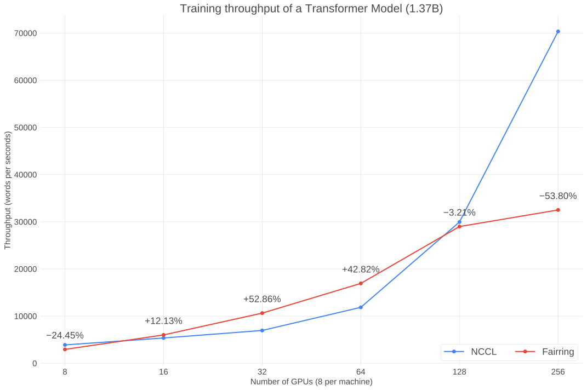
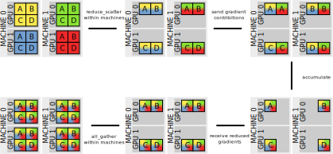
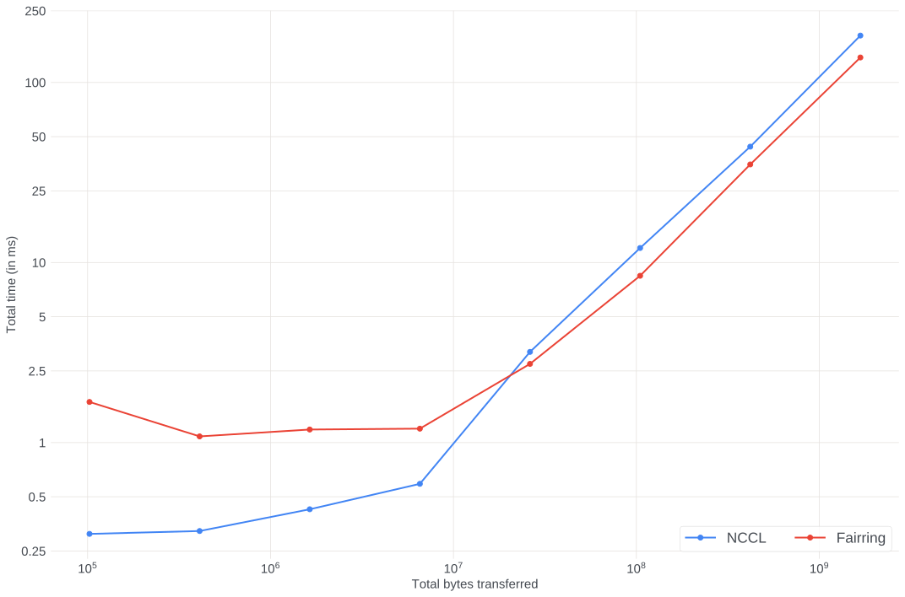
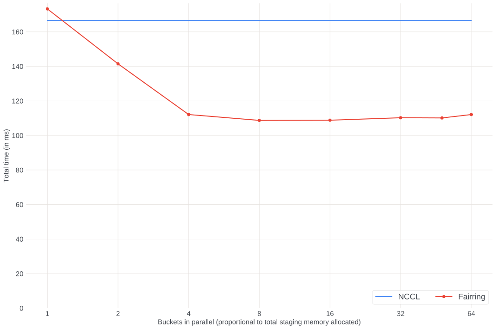
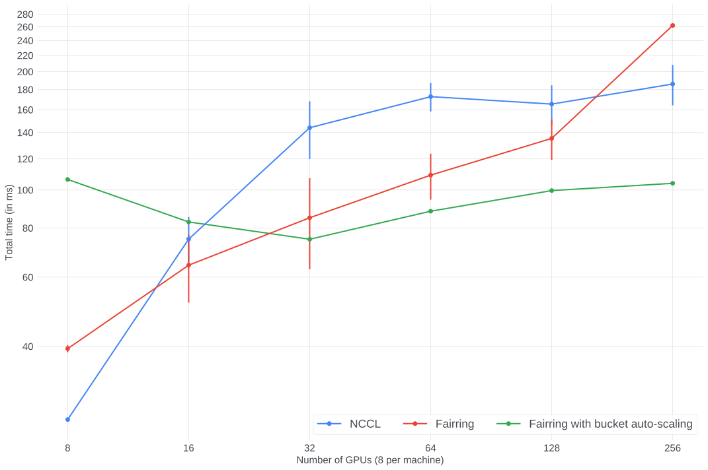

# Fairring (FAIR + Herring): a faster all-reduce

TL;DR:

* Using a variation on Amazon’s "[Herring](https://www.amazon.science/publications/herring-rethinking-the-parameter-server-at-scale-for-the-cloud)" technique, which leverages reduction servers, we can perform the all-reduce collective faster than NCCL:
  * up to **2x** as fast as NCCL in microbenchmarks
  * up to **50%** speedup in end-to-end training workloads
* You can use it right away in your project, with no code changes, by installing our PyTorch extension which is a drop-in replacement for NCCL.

## Overview

Herring is a technique that was "rediscovered" by Amazon about [a year ago](https://www.amazon.science/publications/herring-rethinking-the-parameter-server-at-scale-for-the-cloud), for implementing the all-reduce collective using reduction servers.

Libraries such as NCCL or Gloo implement all-reduce by establishing a ring among all devices and then passing messages on it until all gradients have been propagated everywhere. This requires as many successive rounds of message passing as the total number of GPUs, which leads to poor linear scaling.

Herring, on the other side, uses a client-server approach: every machine sends its own gradient contribution to a global server, which after accumulating all these contributions sends back the final reduced gradient to all clients. Thus a constant number of network hops is performed, regardless of the number of nodes, which ideally should lead to perfect scaling. It’s also straightforward to spread the bandwidth load across an arbitrary number of nodes, by sharding, thus avoiding any bottleneck.

Amazon, [Google](https://cloud.google.com/blog/topics/developers-practitioners/optimize-training-performance-reduction-server-vertex-ai) and [ByteDance](https://github.com/bytedance/byteps) have all adopted this client-server technique, and Fairring is FAIR's take on it!

## Installation with conda pre-built binaries

```bash
conda create -n fairring python=3.9 pytorch cudatoolkit=11.1 fairring -c fairring -c pytorch-nightly -c nvidia -y
```

The Python version can be any of 3.6, 3.7, 3.8 or 3.9, and the CUDA version  any of 10.2, 11.1, 11.3 or 11.5.

## Installation from sources

```bash
# Install CUDA and the static build of NCCL

conda create -n fairring python=3.9 pip pytorch=1.11.0.dev20211112 cudatoolkit=11.1 -c pytorch-nightly -c nvidia -y
conda activate fairring

git clone --recurse-submodules https://github.com/facebookresearch/fairring.git
cd herring
python setup.py install
```

## Usage

Replace:

```
torch.distributed.init_process_group("nccl")
```
with:

```
import fairring

torch.distributed.init_process_group("fairring")
```

## Caveats

* This initial version of Fairring only supports RDMA (i.e., InfiniBand or RoCE with GPUDirect). We will add support for the TCP and other fabrics shortly.
* Fairring implements a custom all-reduce method, but for all other methods it delegates to vanilla NCCL. Hence you will not see any difference for [FSDP](https://fairscale.readthedocs.io/en/latest/api/nn/fsdp.html) (Fully Sharded Data Parallel), since the implementation only uses reduce-scatter and all-gather operations.
* Fairring requires the job’s deployment to be very regular: every machine involved in training must have the same number of GPUs, and they must all be used. This is usually the case already.
* Fairring by default will allocate 50MiB of staging buffers on all GPUs. This can be changed by setting the `FAIRRING_TOTAL_MEMORY` environment variable to another value (in bytes). Note that this might reduce the parallelism of Fairring.
* By default Fairring will use a slice size that matches the DDP default bucket size of 25MiB. To change the slice size (e.g., to keep it in sync with the bucket size, if that gets manually changed) one can set the `FAIRRING_SLICE_SIZE` environment variable (to an amount of bytes).
* If Fairring fails to detect the network interface to listen on it can be manually specified with the `TP_SOCKET_IFNAME` environment variable.
* You’ll need a very recent version of PyTorch, either a prebuilt nightly binary from at least November 12, or a manual build from source from the master branch after [this commit](https://github.com/pytorch/pytorch/commit/0420545639503e293783db7d9f8b6fa80446ca00).

## End-to-end benchmarks

We benchmarked an end to end training run of a 1.37B parameter Transformer model on wikitext-2 data. The benchmarks were run on V100 GPUs with InfiniBand fabric. The figure below shows the throughput comparing both Fairring and NCCL collectives. The y axis represents the throughput in words per second and the x axis represents the number of GPUs used which scale from 8 to 256 (or nodes from 1 to 32). The data labels represent the percentage increase in throughput when Fairring is compared to NCCL.

With Fairring we see an increase in throughput of **52.86%** at 32 GPUs and **42.82%** at 64 GPUs. The scaling efficiency at 32 GPUs and 64 GPUs is 90% and 72% respectively. In contrast, with NCCL we see the highest scaling efficiency at 16 GPUs with 68%. At smaller scale, Fairring underperforms NCCL when running on 8 - 16 GPUs since the overhead of the 2 hops over network with sharding is slower than NCCL’s all-reduce. We also haven’t optimized for the single machine codepath, where we could skip sending gradients to the server.

Amazon’s experiments with the Roberta model (1.3B) show a throughput increase of 29% at 64 GPUs with a scaling efficiency of 70%. The Herring paper does show results that indicate a 85% scaling efficiency irrespective of the cluster size (64 GPUS - 512 GPUs). Google has only [published](https://cloud.google.com/blog/topics/developers-practitioners/optimize-training-performance-reduction-server-vertex-ai) seeing a throughput increase when training a BERT model from 0.4 to 0.7 words per second when running on 8 NVIDIA A100s.

However, past the 128 GPU mark we do observe that Fairring fails to scale like NCCL. This is unexpected since Fairring is supposed to scale linearly with the number of GPUs. We suspect this behavior is caused by Fairring "over sharding" when running on too many machines, and possibly being bottlenecked on CPU. We observe this same behavior in our microbenchmarks (see below), where we were able to mitigate this by scaling the bucket size with the number of GPUs, and we thus believe a similar solution should help for end-to-end performance too.



## Our take on Herring



An all-reduce in Fairring is broken down into two layers: intra-machine and inter-machine. It proceeds as follows:

* First a local reduction step takes place among the GPUs of each machine. This is done to take advantage of the high bandwidth of the intra-machine NVLinks to "deduplicate" the gradients of the local GPUs so that we have less data to send over the inter-machine InfiniBand, which is slower. We perform this step using the reduce-scatter primitive of NCCL (yes, Fairring internally uses NCCL), which means the result of this local reduction is spread across all GPUs. That’s because each machine has multiple InfiniBand cards, connected to different GPUs, hence we can only reach peak bandwidth if all GPUs participate in the process.
* Then each gradient is sharded and shared across all machines: each machine sends the first chunk of its gradient to the first machine, and the second chunk to the second machine, and so on. In a sense, this is an all-to-all operation. We do this step using TensorPipe, which was born to serve this kind of point-to-point use cases. To avoid over-sharding, we use a "rails" topology: GPU N on one machine only communicates with GPU N of other machines. This also reduces the total number of pairwise connections we need to establish.
* Once a GPU has received all gradient chunks from all other GPUs, it adds them together.
* Then it sends the fully reduced gradient back to all the GPUs from which it had received a chunk.
* And in the final step we "reverse" the initial reduce-scatter: now each GPU holds a portion of the final gradient, and we need to send this to the other GPUs on that machine, hence we do a local all-gather step among them, again using NCCL.

Some of the steps require a staging area to store some intermediate result. For that, we allocate upfront a certain number of fixed buffers, which we reuse. If the tensor given to Fairring is larger than one of these buffers, the tensor is cut into slices, each of which is processed separately, as if it were its own tensor. The careful reader will have noticed that Fairring does a "three-dimensional" sharding: first a tensor is flattened and cut into slices (as described just above) if it’s too big; then each slice goes through the reduce-scatter within the machine and each GPU gets one "slot" of that slice; finally that slot is split into shards, each of which is sent to a different machine.

Notice that, as the number of machines used for training increases, the number of steps performed by Fairring remains constant. Moreover, the data sent and received by each GPU also remains constant because the increase in the number of machines is perfectly counterbalanced by the decrease in the shard size. This means that no hotspot, congestion or degradation should appear as the job size increases.

## Differences with Amazon’s design

If you’ve read the Amazon paper you might have noticed that our version of Herring ended up being different from what they described. The principles that guided our design were for Fairring to be a viable drop-in replacement for NCCL in PyTorch’s distributed data parallel (DDP) training, and we wanted to optimize it for the InfiniBand GPUDirect fabric.

Amazon suggested a clear separation between the client and the reduction servers, with the latter ones hosted on commodity CPU-only machines, which had to be launched and managed separately. Instead, we opted to have each GPU "double" as both a client and a server (thus avoiding extra processes and machines). Moreover, we chose to store gradients on GPU, to take advantage of fast interconnect, at a cost of a slightly higher memory consumption on GPU (i.e., by default Fairring allocates 50MiB). Another consequence of offloading communication to GPUs and InfiniBand is that we don’t need proxy servers or other multithreading techniques on CPU to reach high bandwidths.

Amazon also stresses a lot the role that its Elastic Fabric Adapter (EFA) has in making Herring viable, and particularly its Scalable Reliable Datagram mode and its Equal-Cost Multi-Path routing. Our understanding is that EFA is a technology that tries to mimic InfiniBand while using an Ethernet link layer (cables and switches), basically Amazon’s flavor of RDMA over Converged Ethernet (RoCE), and thus we believe that an InfiniBand network should perform about as well. We’re currently using connection-oriented transfers, rather than datagram-based, and we don’t really know how routing is set up.

Another technique that is given a lot of importance in Amazon’s paper is the balanced fusion buffers. We believe that the bucketing performed by default by PyTorch’s DDP library combined with the sharding done by Fairring internally should be essentially equivalent to that feature.

## Better overlapping than NCCL

During the backwards pass, once "enough" gradients have been computed locally they are put by PyTorch’s DDP in a so-called bucket which is then immediately passed to all-reduce, even while the rest of the backwards pass is still running. This is done so that the communication of that bucket can overlap with the computation of further gradients. This saves time and leads to higher average GPU utilization.

However, when using NCCL, all these all-reduce operations are enqueued on the same stream and, due to NCCL’s synchronous/blocking behavior (within the stream), one such operation cannot even start until the previous one has completely finished. Hence there is no overlap between these all-reduce operations. This can cause a backlog of such operations to build up on the stream, and waiting for it to flush will cause a delay between the end of the backward pass and the optimizer step, hence slowing down the job. (In some cases the all-reduce operations complete at a faster rate than the one at which they’re enqueued, and thus they never build up, but this only happens in jobs that are compute-bound, which is not what we’re focusing on here since those jobs won’t benefit from any improvement to communication).

In Fairring we’ve tried hard to allow successive operations to overlap with each other. For some substeps we use NCCL, hence these substeps are still mutually exclusive, but they can run in parallel to other substeps. For the main inter-machine steps we use TensorPipe, which is extremely asynchronous: Fairring code just schedules a transfer with TensorPipe, and will be notified when it terminates, but in the meantime Fairring can go back to do other things, such as scheduling other transfers, which will be carried out by TensorPipe in parallel. Hence the only queuing that will happen is "on the wire", if there’s not enough bandwidth, but we don’t think we can do much about that. (The number of staging buffers that Fairring was allowed to allocate will also impose a limit to concurrency, but that can be tuned).

## Microbenchmarks

To gain more insight into some specific aspects of Fairring, we ran a set of microbenchmarks where we explored the effect of changing a single parameter of our algorithm.

### Single transfers

First we compared the "one-shot" performance, where we perform a single all-reduce (no queuing, no overlapping) for a tensor of various sizes. In other words, there’s a single bucket which holds the entire input tensor. We ran this on 8 machines.



We see that for small tensors (up to ~6MiB) NCCL is faster, but for larger tensors (25MiB or more) Fairring starts outperforming NCCL. At 100MiB, Fairring is 43% faster than NCCL. In real workloads we expect Fairring to run at a regime of 25MiB per bucket as that’s the default value used by DDP, hence these results suggest good performance there. We suspect the performance degradation for small tensors is due to Fairring ending up "oversharding" and, with each shard being so small, any overhead becomes more prominent. We should still look into it and see if we can improve it somehow.

### Overlap/Parallelism

Then we looked at the role of parallelism/overlap in Fairring, to determine how much it helps. We took 64 buckets of 25MiB each (hence 1.6GB total), but we limited the staging memory that Fairring was allowed to allocate to force only a certain number of buckets to be able to be transferred in parallel. This again was run on 64 GPUs.



The "shape" of the results is exactly what we expect. We see that increasing parallelism helps (it decreases the total time) but only up to a point, since presumably eventually some other bottleneck factors will kick in which make further parallelism useless. Here that sweet spot appears to be at 4 or slightly above, at which point Fairring is around 50% faster than NCCL. NCCL doesn’t allow any parallelism, hence we ran it only once and plotted the result as a constant line.

### Scaling

Lastly, but most interestingly, we looked at the effects of scale (i.e., number of machines) on performance. We again used 64 buckets of 25MiB each, with max parallelism, and increased the number of machines from 1 (with 8 GPUs) to 32 (with 256 GPUs). We’re plotting the average of multiple jobs in order to counter the variability we experienced due to running on different sets of machines.



* The left-hand side of the plot is exactly what we expect: on small jobs Fairring doesn’t perform too well (although it’s already faster than NCCL except for single machine, which is a codepath we could optimize but didn’t), but it gets better as the job scales. At peak, Fairring was 2x as fast as NCCL.
* The right-hand side is more unexpected: NCCL’s performance appears to plateau, which runs contrary to our understanding. We suspect that this could be due to NCCL changing its algorithm from rings to some other topology such as trees when it detects the job being too large. But, more importantly, we see that Fairring’s performance sharply declines and becomes worse than NCCL’s for 256 GPUs. Our theory is that at such large scales we hit again the problem of our shards becoming too small, and thus wasting too much time due to overhead. In order to test this hypothesis we also launched one run where the bucket size increases proportionally to the number of machines (i.e., 25MiB for 8 machines, 50MiB for 16 machines, 100MiB for 32 machines) in order for the shards to remain of the same size. We plotted this and saw that this leads to much better scaling and it ensures Fairring to outperform NCCL with a consistent margin even at large scales.

## Team

The Fairring project was started by [Anjali Sridhar](https://github.com/anj-s) and is now a collaboration with [Luca Wehrstedt](https://github.com/lw) and [Shen Li](https://github.com/mrshenli).

## License

Fairring is BSD licensed, as found in the [LICENSE.txt](LICENSE.txt) file.